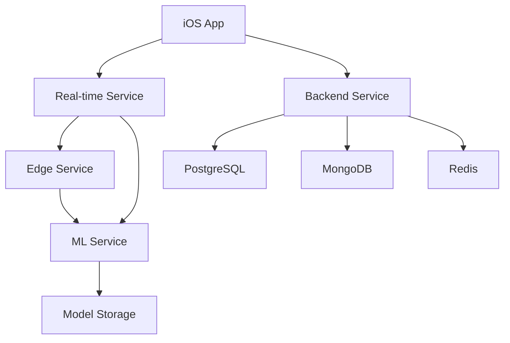

# 👨‍💻 Seminote Development Guide

> **Comprehensive development documentation for the Seminote Piano Learning Platform**

## 📋 Overview

This guide provides everything developers need to contribute to the Seminote platform, from initial setup to deployment procedures.

## 🚀 Quick Start

### Prerequisites

#### Required Software
- **Git**: Version control
- **Docker**: Containerization (v20.10+)
- **Node.js**: JavaScript runtime (v18+)
- **Java**: JDK 17+ for Spring Boot services
- **Python**: v3.9+ for ML services
- **Go**: v1.19+ for edge services
- **Xcode**: v14+ for iOS development (macOS only)

#### Development Tools
- **IDE**: IntelliJ IDEA (Java), Xcode (iOS), VS Code (Node.js/Python)
- **Database**: PostgreSQL, MongoDB, Redis
- **Message Queue**: RabbitMQ
- **Monitoring**: Prometheus, Grafana

### Environment Setup

#### 1. Clone Repositories
```bash
# Create workspace directory
mkdir seminote-workspace && cd seminote-workspace

# Clone all repositories
git clone https://github.com/seminote/seminote-docs.git
git clone https://github.com/seminote/seminote-ios.git
git clone https://github.com/seminote/seminote-backend.git
git clone https://github.com/seminote/seminote-realtime.git
git clone https://github.com/seminote/seminote-ml.git
git clone https://github.com/seminote/seminote-edge.git
git clone https://github.com/seminote/seminote-infrastructure.git
```

#### 2. Start Infrastructure Services
```bash
# Navigate to backend directory
cd seminote-backend

# Start databases and message queue
docker-compose up -d postgres mongodb redis rabbitmq

# Verify services are running
docker-compose ps
```

#### 3. Start Development Services
```bash
# Terminal 1: Backend Services (Java/Spring Boot)
cd seminote-backend
./gradlew bootRun

# Terminal 2: Real-time Services (Node.js)
cd seminote-realtime
npm install && npm run dev

# Terminal 3: ML Services (Python)
cd seminote-ml
pip install -r requirements.txt
python -m uvicorn main:app --reload

# Terminal 4: Edge Services (Go)
cd seminote-edge
go mod tidy && go run main.go
```

## 🏗️ Architecture Overview

### Repository Structure
```
seminote-workspace/
├── seminote-docs/           # Documentation
├── seminote-ios/            # iOS application
├── seminote-backend/        # Java/Spring Boot services
├── seminote-realtime/       # Node.js WebRTC services
├── seminote-ml/             # Python ML services
├── seminote-edge/           # Go edge computing
└── seminote-infrastructure/ # Terraform/CloudFormation
```

### Service Dependencies


## 🔧 Development Workflow

### Git Workflow
1. **Feature Branches**: Create feature branches from `main`
2. **Naming Convention**: `feature/description`, `bugfix/description`, `hotfix/description`
3. **Pull Requests**: All changes must go through PR review
4. **Code Review**: Minimum 2 approvals required
5. **CI/CD**: Automated testing and deployment

### Branch Protection Rules
- **Main Branch**: Protected, requires PR and reviews
- **Status Checks**: All CI checks must pass
- **Up-to-date**: Branches must be up-to-date before merge
- **Admin Override**: Disabled for consistency

### Commit Message Format
```
type(scope): description

[optional body]

[optional footer]
```

**Types**: `feat`, `fix`, `docs`, `style`, `refactor`, `test`, `chore`

**Examples**:
```
feat(ios): add speed-adaptive processing mode
fix(backend): resolve user authentication issue
docs(api): update WebRTC endpoint documentation
```

## 🧪 Testing Strategy

### Testing Pyramid
1. **Unit Tests**: 70% coverage target
2. **Integration Tests**: Service-to-service testing
3. **End-to-End Tests**: Complete user journey testing
4. **Performance Tests**: Latency and throughput validation

### Testing Commands

#### Backend (Java/Spring Boot)
```bash
# Run all tests
./gradlew test

# Run specific test class
./gradlew test --tests UserServiceTest

# Generate coverage report
./gradlew jacocoTestReport
```

#### Real-time (Node.js)
```bash
# Run unit tests
npm test

# Run integration tests
npm run test:integration

# Run with coverage
npm run test:coverage
```

#### ML Services (Python)
```bash
# Run tests with pytest
pytest tests/

# Run with coverage
pytest --cov=src tests/

# Run specific test file
pytest tests/test_audio_analysis.py
```

#### iOS (Swift)
```bash
# Run tests from command line
xcodebuild test -scheme Seminote -destination 'platform=iOS Simulator,name=iPhone 14'

# Or use Xcode Test Navigator (⌘+6)
```

## 📊 Code Quality Standards

### Code Style Guidelines

#### Java/Spring Boot
- **Style Guide**: Google Java Style Guide
- **Formatter**: IntelliJ default formatter
- **Linting**: Checkstyle with custom rules
- **Documentation**: Javadoc for public APIs

#### Swift/iOS
- **Style Guide**: Swift API Design Guidelines
- **Formatter**: SwiftFormat
- **Linting**: SwiftLint
- **Documentation**: Swift DocC

#### Node.js/JavaScript
- **Style Guide**: Airbnb JavaScript Style Guide
- **Formatter**: Prettier
- **Linting**: ESLint
- **Documentation**: JSDoc

#### Python
- **Style Guide**: PEP 8
- **Formatter**: Black
- **Linting**: Flake8, mypy for type checking
- **Documentation**: Sphinx with Google style docstrings

#### Go
- **Style Guide**: Effective Go
- **Formatter**: gofmt
- **Linting**: golangci-lint
- **Documentation**: godoc

### Quality Gates
- **Code Coverage**: Minimum 80% for new code
- **Complexity**: Maximum cyclomatic complexity of 10
- **Duplication**: Maximum 3% code duplication
- **Security**: No high/critical security vulnerabilities

## 🚀 Deployment Process

### Environments
1. **Local**: Developer machines
2. **Development**: Shared development environment
3. **Staging**: Pre-production testing
4. **Production**: Live environment

### CI/CD Pipeline
```yaml
# GitHub Actions workflow
name: CI/CD Pipeline
on: [push, pull_request]

jobs:
  test:
    runs-on: ubuntu-latest
    steps:
      - uses: actions/checkout@v3
      - name: Run tests
        run: ./scripts/test.sh
  
  build:
    needs: test
    runs-on: ubuntu-latest
    steps:
      - name: Build Docker image
        run: docker build -t seminote/service .
  
  deploy:
    needs: build
    if: github.ref == 'refs/heads/main'
    runs-on: ubuntu-latest
    steps:
      - name: Deploy to staging
        run: ./scripts/deploy.sh staging
```

### Deployment Commands
```bash
# Deploy to staging
./scripts/deploy.sh staging

# Deploy to production (requires approval)
./scripts/deploy.sh production

# Rollback deployment
./scripts/rollback.sh production v1.2.3
```

## 🔍 Debugging & Monitoring

### Local Debugging
- **Backend**: IntelliJ debugger, Spring Boot DevTools
- **iOS**: Xcode debugger, Instruments
- **Node.js**: VS Code debugger, Chrome DevTools
- **Python**: PyCharm debugger, pdb
- **Go**: Delve debugger

### Logging Standards
```java
// Java example
private static final Logger logger = LoggerFactory.getLogger(UserService.class);

logger.info("User {} logged in successfully", userId);
logger.warn("Failed login attempt for user {}", username);
logger.error("Database connection failed", exception);
```

### Monitoring & Observability
- **Metrics**: Prometheus + Grafana
- **Logging**: ELK Stack (Elasticsearch, Logstash, Kibana)
- **Tracing**: Jaeger for distributed tracing
- **Error Tracking**: Sentry for error monitoring
- **Health Checks**: Spring Boot Actuator, custom health endpoints

## 📁 Detailed Guides

- [`getting-started.md`](./getting-started.md) - Detailed setup instructions
- [`local-setup.md`](./local-setup.md) - Local development environment
- [`testing.md`](./testing.md) - Comprehensive testing guide
- [`deployment.md`](./deployment.md) - Deployment procedures and best practices

## 🤝 Contributing

### Getting Help
- **Slack**: #seminote-dev channel
- **GitHub Issues**: Bug reports and feature requests
- **GitHub Discussions**: General questions and discussions
- **Code Review**: Tag relevant team members

### Team Structure
- **@backend-team**: Java/Spring Boot services
- **@ios-team**: iOS application development
- **@ml-team**: Machine learning and AI
- **@devops-team**: Infrastructure and deployment
- **@frontend-team**: Web interfaces (future)

---

**👨‍💻 Building the future of piano education through collaborative development**
